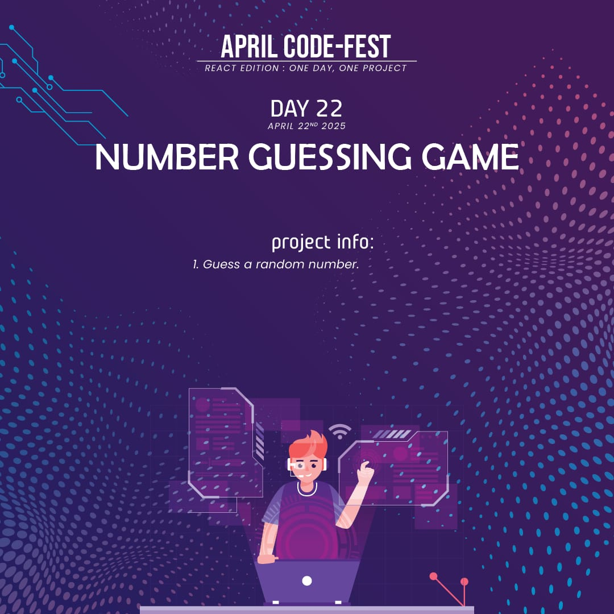
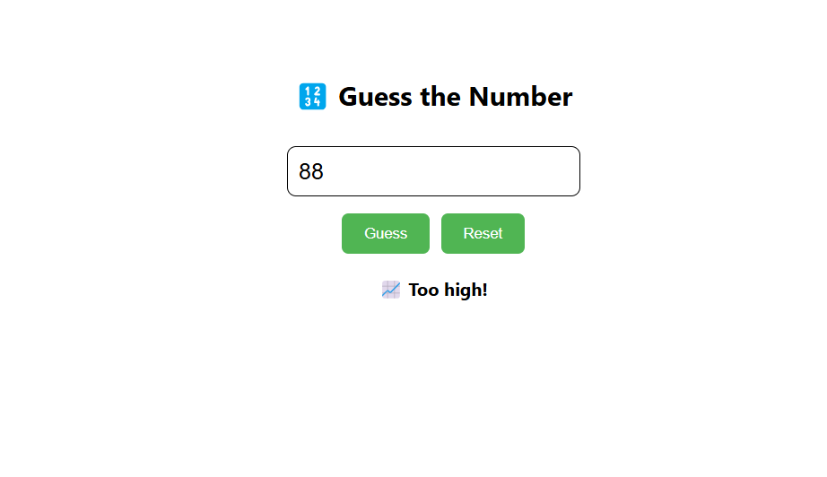

# 🎯 Number Guessing Game 

A fun and interactive **number guessing game** built with React. Users try to guess a randomly generated number with helpful hints like “Too high” or “Too low”. 

---

## 📌 Features
- ✅ **Random Number Generator**: Generates a new number each time the game resets.
- ✅ **Input Validation**: Alerts if the input is not a number.
- ✅ **Guess Feedback**: Tells you if your guess is too high, too low, or correct.
- ✅ **Simple Reset**: Instantly start a new game with the reset button.
- ✅ **Clean UI**: Styled using a custom CSS file.

---

## 🛠️ Technologies Used
- ⚛️ **React** (`useState`)
- 🧠 **JavaScript** (Simple logic in `num.js`)
- 🎨 **CSS** (`style.css` for styling)


---


## 🚀 Live Demo
To see it in action, clone the repository and follow the setup instructions below.

1. **Clone the repository:**

   ```bash
   git clone https://github.com/Eshhaa11/number-guessing-game
   
   
2. **Navigate to the project directory:**

   cd  number-guessing-game

3. **Install dependencies:**

   npm install

4. **Start the development server:**

   npm start

5. **Open your browser and visit:**

   http://localhost:3000

---

 ## 🎨 Screenshots:
 


 ---

 ## 🤝 Contributing:
 Want to improve this project? Fork the repository, create a feature branch, and open a pull request. All contributions are welcome! 🚀✨
 
 ---

 🎉 Happy Coding!